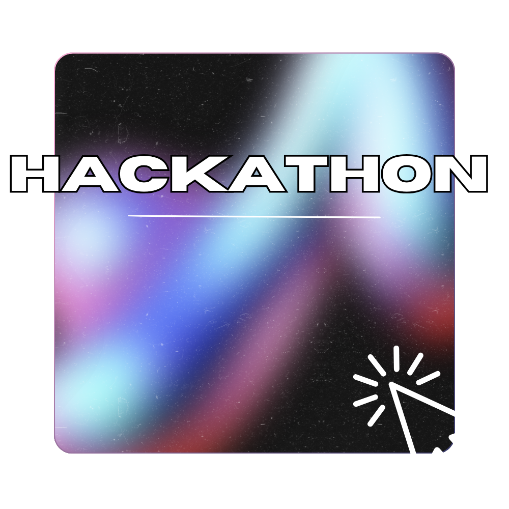
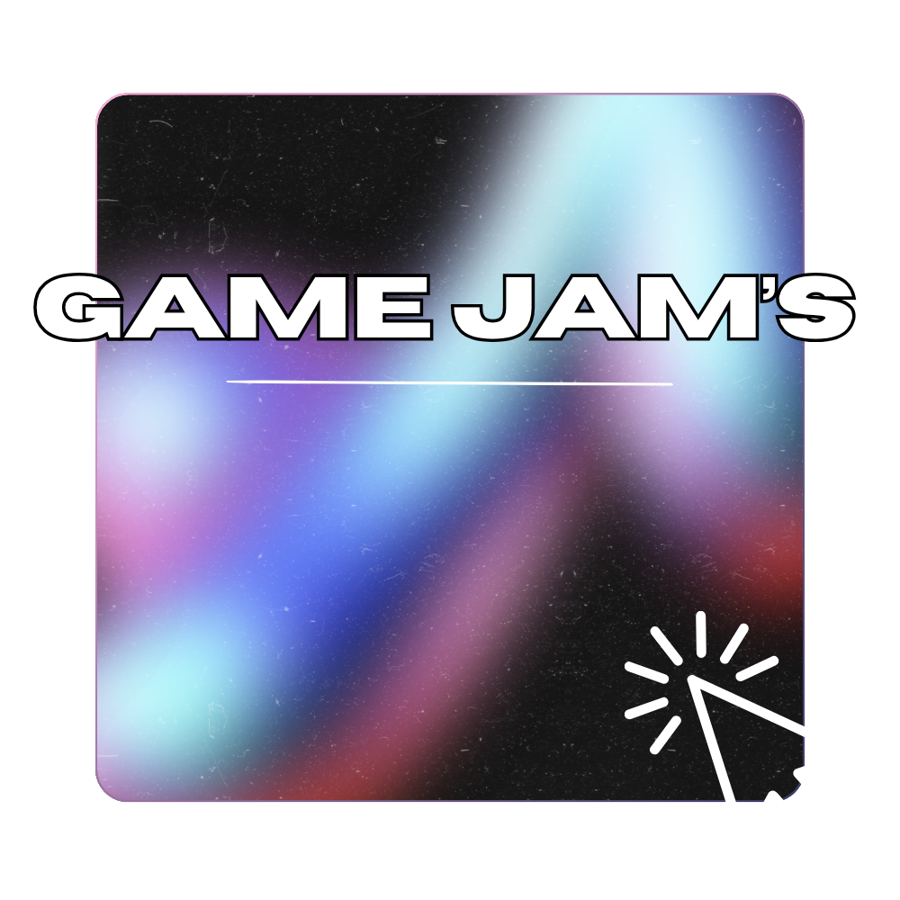
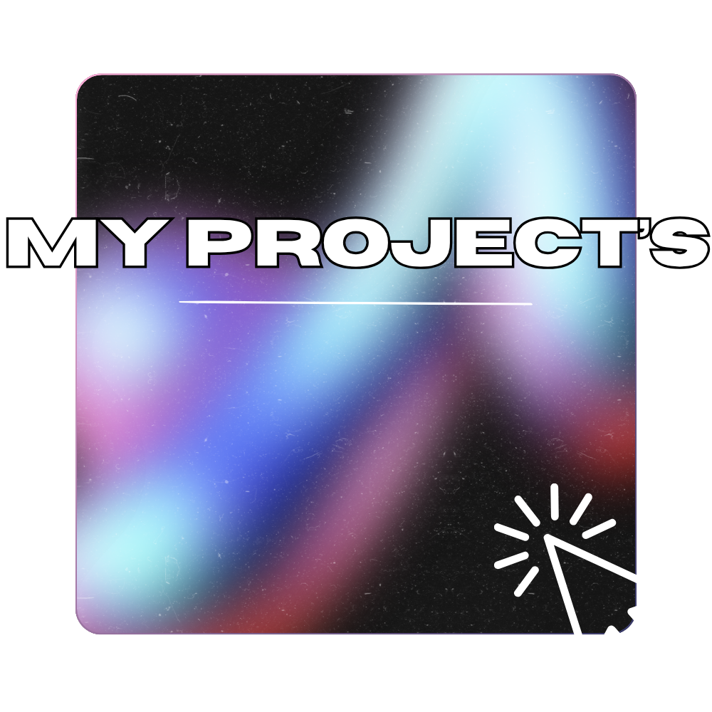

## About me

Student @ **42 Lausanne**   
I build **RAG pipelines**, **LLM integrations** and **automation tools**  
**Won 2 hackathons** (Infomaniak, AI Innovation Lab)  
**Creator** of Wizlean — AI-powered LinkedIn SaaS

**Skills**  
**Languages →** Python, C, C++  
**AI →** RAG pipelines, LangChain, Replicate, HuggingFace, OpenAI API  
**Infra →** Docker, FastAPI, Linux, Bash  

 

 

## Quick links

