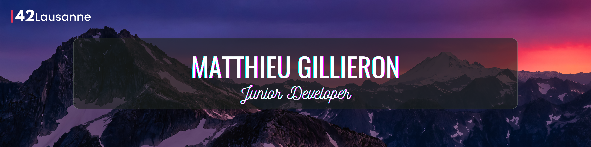
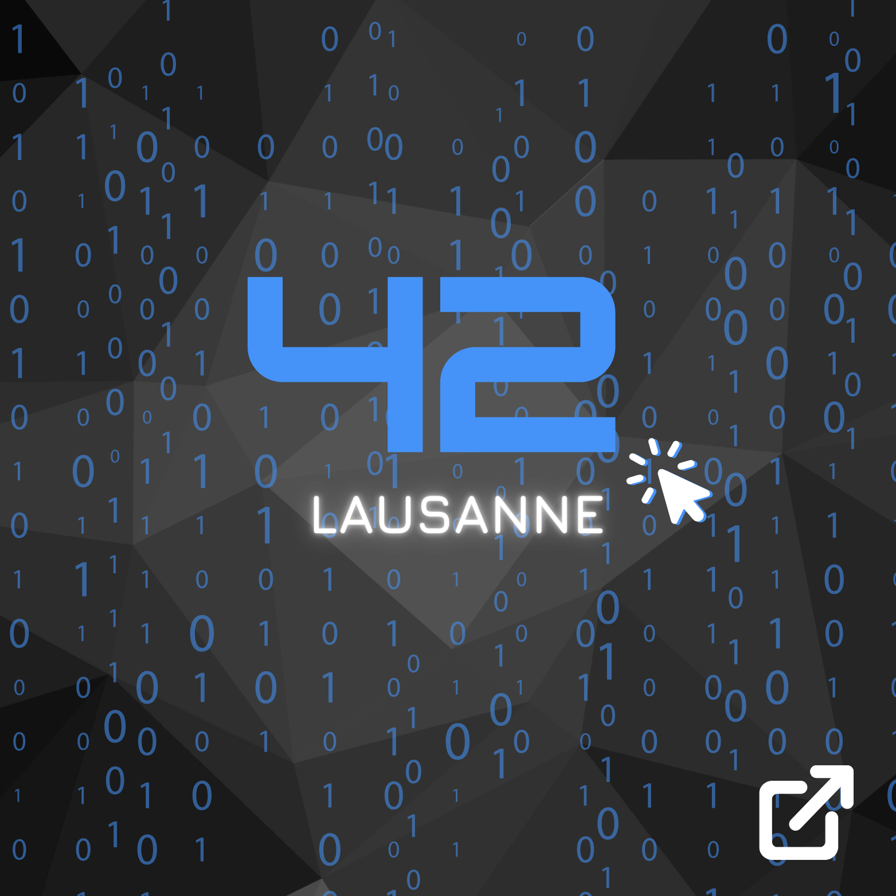

## Welcome to my world ! 👤

<picture>
   
</picture>

- 👨‍🎓 I am currently a student at 42 Lausanne
- ⚙️ I am passionate about both programming and mechanics
- ⚡️ My goal → create solutions that meet real needs

## Let's Collaborate! 🫵

- 🤖 Projects utilizing <strong> AI </strong> and <strong> ML </strong>
- 👨‍💻 Projects related to improving <strong> UI/UX </strong>
- 🚀 Project stimulating and enriching !
- 🌐 Feel free to reach out on <a href="https://linkedin.com/in/matthieu-gillieron-developer"><strong>LinkedIn</strong></a> for a quick response
- 📧 You can also contact me via <a href="mailto:gillieron.matthieu@ik.me"><strong>email</strong></a> for any opportunities or collaboration

## 📖 Click to see !

<table>
  <tr>
    <td align="center">
      
    </td>
    <td align="center">
      
    </td>
    <td align="center">
      
    </td>
 <td align="center">
      
    </td>
 <td align="center">
      
    </td>
  </tr>
  <tr>
    <td align="center" colspan="5">
      
    </td>
  </tr>
</table>

 

---

 

<table align="center">
  <!-- Première ligne : Image stats_tools -->
  <tr>
    <td align="center" colspan="2">
      
    </td>
  </tr>
  <tr>
    <td align="center">
      
    </td>
    <td align="center">
      
    </td>
  </tr>
  
  <!-- Deuxième ligne : Widgets de stats -->
  
  <!-- Troisième ligne : Icônes centrées -->
  <tr>
    <td align="center" colspan="2">
      
      
      
      
      
      
      
      
      
      
      
    </td>
  </tr>
</table>

 

<h4 align="center"> System.log("Agent Smiths deployed...") </h4>

 

  

---

On 24 April 2025, the choice is still in the Matrix ⏳
