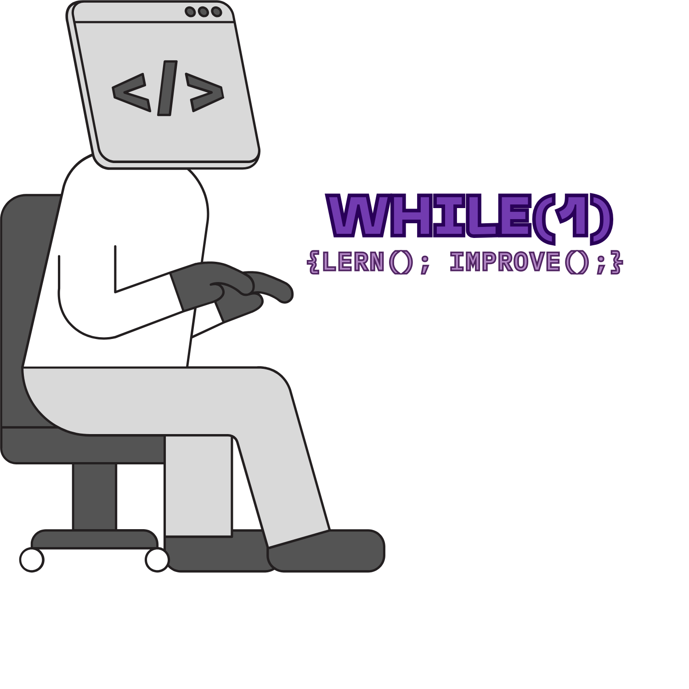
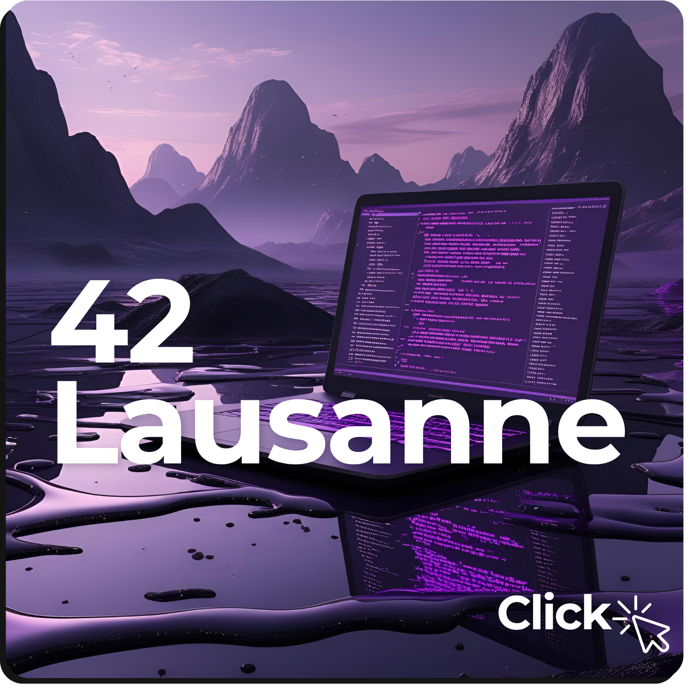
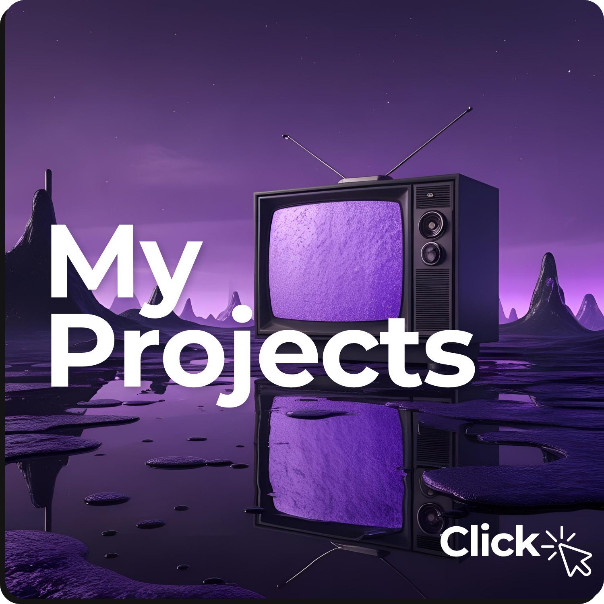
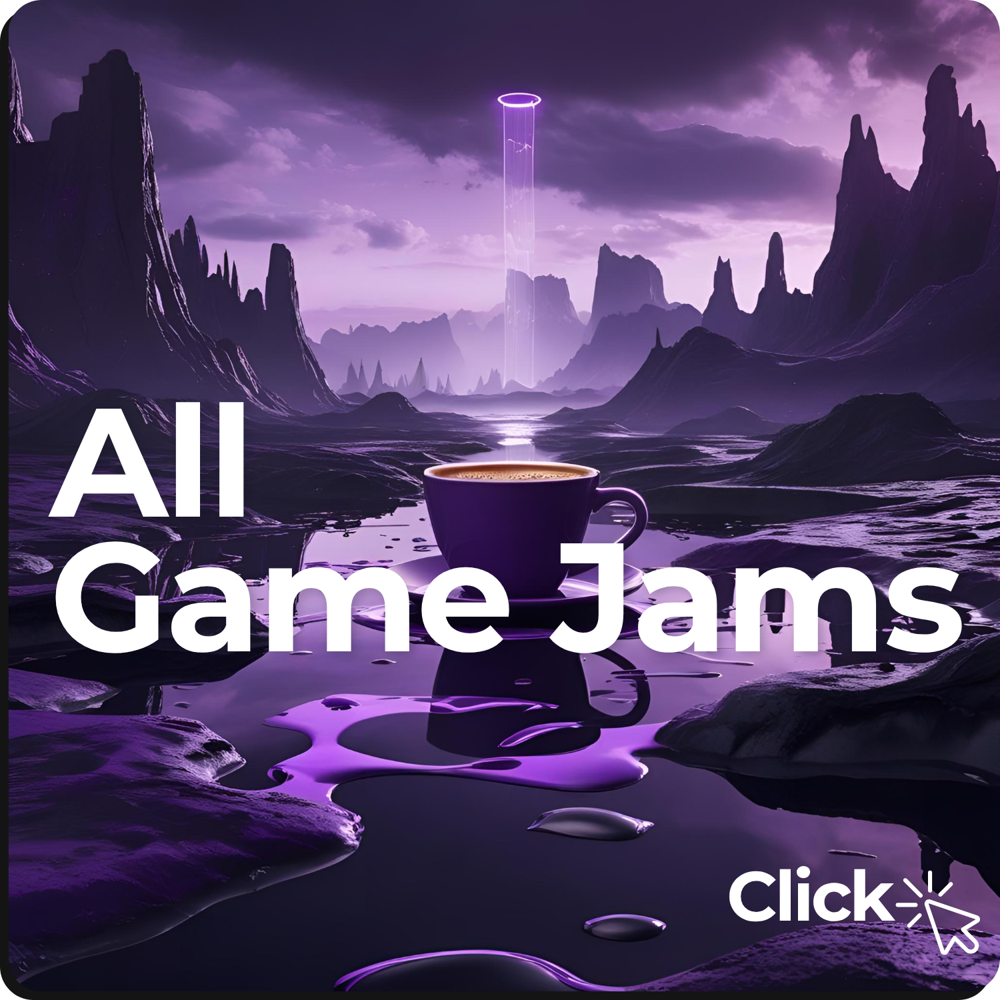
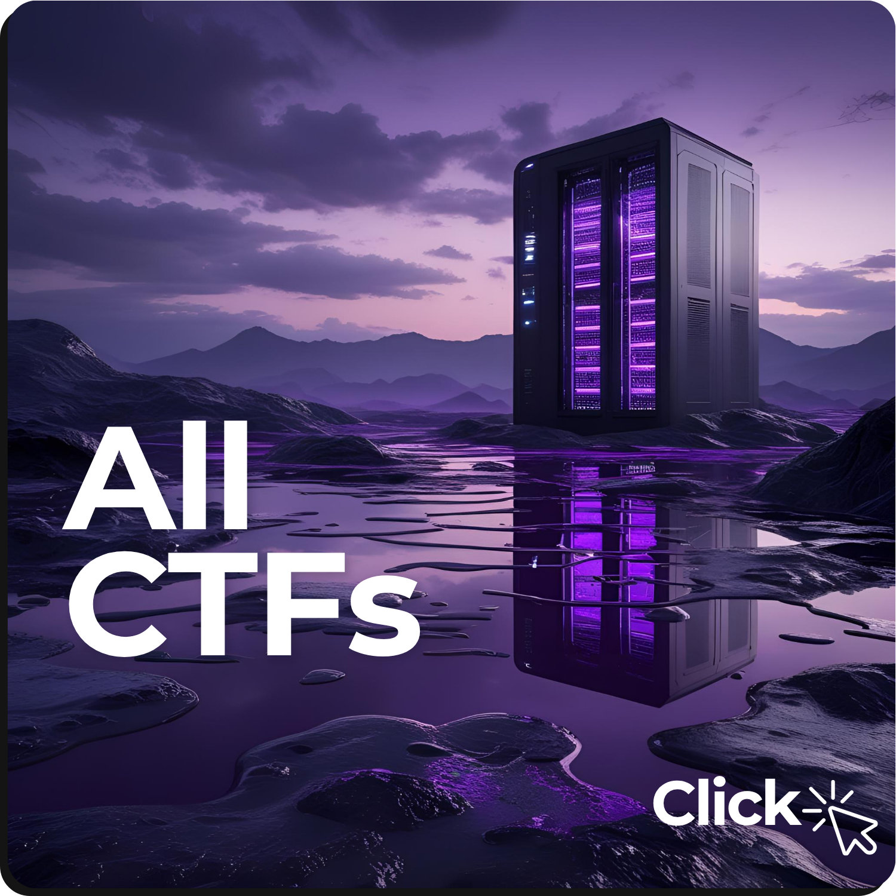

## Welcome to my world ! 👤

<picture>
   
</picture>

- 👨‍🎓 I am currently a student at 42 Lausanne
- ⚙️ I am passionate about both programming and mechanics
- ⚡️ My goal → create solutions that meet real needs

## Let's Collaborate! 🫵

- 🤖 Projects utilizing <strong> AI </strong> and <strong> ML </strong>
- 👨‍💻 Projects related to improving <strong> UI/UX </strong>
- 🚀 Project stimulating and enriching !
- 🌐 Feel free to reach out on <a href="https://linkedin.com/in/matthieu-gillieron-developer"><strong>LinkedIn</strong></a> for a quick response
- 📧 You can also contact me via <a href="mailto:gillieron.matthieu@ik.me"><strong>email</strong></a> for any opportunities or collaboration

## 📖 Click to see !

  
  
  
  
  

 

 ## How I’ve Been Breaking My Keyboar 📊

  
  

 

  

 

<h4 align="center"> System.log("Agent Smiths deployed...") </h4>

 

  

