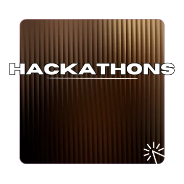
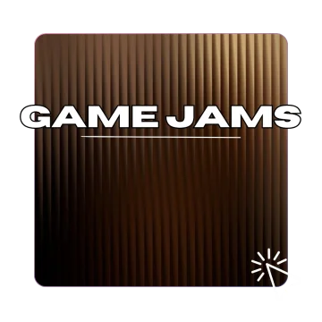
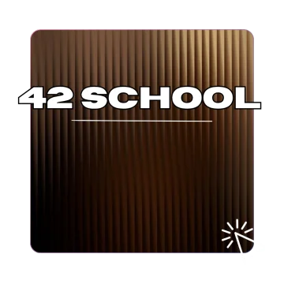
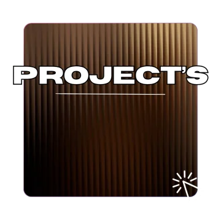

```About me```  
Student @ 42 Lausanne  
Focused on building reliable AI systems (RAG, LLM integration, automation)  
Seeking internship or junior position in AI / software engineering  

```Highlights```  
Won both hackathons I participated in (Infomaniak, AI Innovation Lab)  
Built **[Wizlean](https://wizlean.com)**, a LinkedIn automation tool using AI  
Developed and deployed multiple RAG-based applications  

```Profile```  
Design and implementation of **RAG pipelines**  
Integration of **LLMs into real-world applications**  
Development of **automation tools** to improve workflows  
Strong backend and low-level foundation (C, C++, Python)  

```Projects```  
[Wizlean](https://wizlean.com) → AI tool for LinkedIn content automation  
[Portfolio](https://gillieron.dev) → Retrieval-based chatbot connected to a portfolio  
[42 Shcool](https://github.com/MatthieuGillieron/cursus) → Algorithms, memory management, system programming  ( C / C++)  

```Skills```  
Languages → Python · C · C++  
AI / Data → RAG · LangChain · HuggingFace · Replicate  
Infrastructure → Docker · FastAPI · Linux · Bash  
  

## Quick links
<div align="left">
<a href="https://github.com/MatthieuGillieron/hackathons" target="_blank">

</a>
<a href="https://github.com/MatthieuGillieron/game_jam" target="_blank">

</a>
<a href="https://github.com/MatthieuGillieron/cursus" target="_blank">

</a>
<a href="https://github.com/MatthieuGillieron/projetPersonnel" target="_blank">

</a>
</div>
