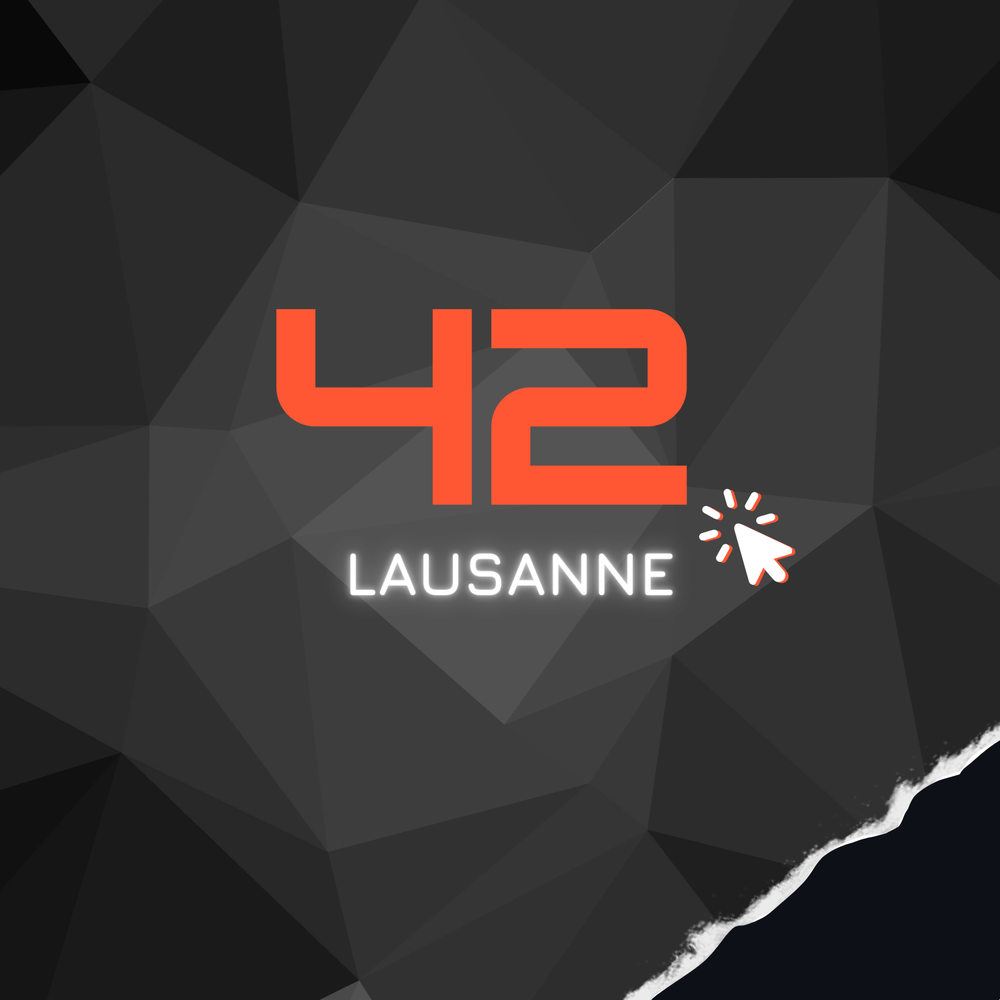
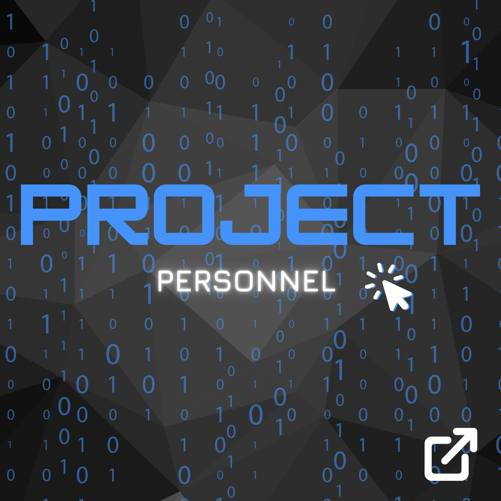
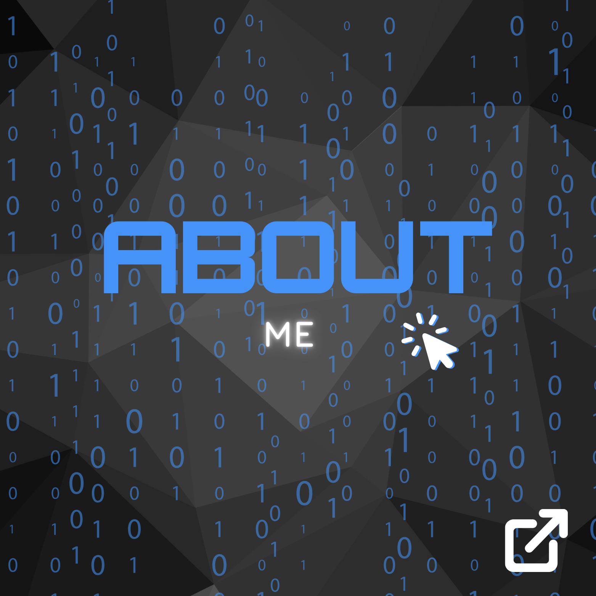

## 🤠 I'am a passionate junior developer

Currently studying at **42 Lausanne**. My goal is to continually learn and further specialize in the field of **artificial intelligence (AI)**, particularly in **Machine Learning** and **Deep Learning**. What motivates me is bringing ideas to life by transforming them into practical and concrete solutions that address real-world needs.

##  🚀 Current Projects

 - **Intelligent Chatbot:** I am currently working on a chatbot that utilizes various **Language Models (LLM)** and specialized agents. These agents are trained to address specific problems and operate in different domains.

 - **Video Analysis and Summarization:**  I will soon begin a project aimed at translating videos into text and automatically detecting the most impactful or interesting sections. The goal is to turn these sections into engaging posts, perfect for platforms like LinkedIn.

 

## 🤝 Let's Collaborate!

- Projects utilizing **artificial intelligence** and **Machine Learning**.
- Projects related to improving **UI/UX** (user interface and user experience).
- Any other project that presents a stimulating and enriching challenge!

 

## 📨 How to contact me ↘︎

- Feel free to reach out to me on [**LinkedIn**](https://linkedin.com/in/matthieu-gillieron-developer), where I will respond quickly.  
- You can also contact me via [**email**](mailto:gillieron.matthieu@ik.me) for any opportunities or collaboration.

 

## 📖 Dive Into My World 

 - Just below, you'll find a library showcasing my journey, personal projects, and more about me. Click on the images to explore further and discover my world.

    
    
    

---

### 📊 My Stats at a Glance :

 

  
  

### ⚒️ Languages and Tools I use :

