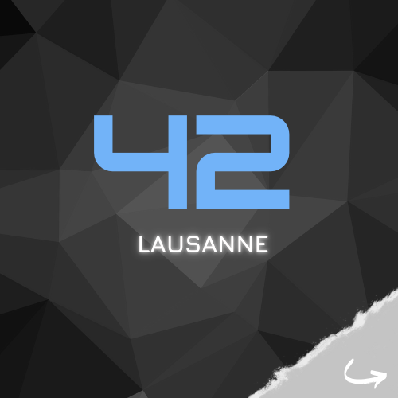

<h1 align="center">Matthieu Gilliéron</h1>

<i>∙ Passionné par le code et la mécanique ! 💻 ⚙️</i>

<i>∙ Mon objectif : transformer les idées en solutions ! 💡</i>

<i>∙ Étudiant à 42 Lausanne ! 📈🚀</i>

---

### Me contacter :

---

### Languages et outils :

---

### Quelques statistiques :

 

    
    
    

---

### Ma bibliothèque :

    
    

